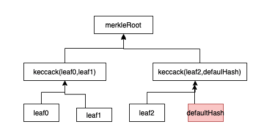
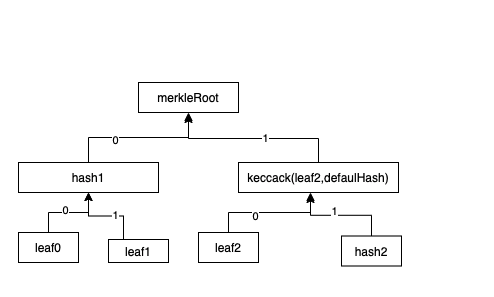
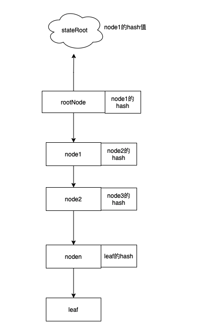

### CTC:batches：

主要功能为保存所有batch(一连串交易信息的集合)的BatchHeader(提供了单个batch的全局信息，包括此batch的Index和此batch内部的merkleRoot)的hash值。用来验证之后消息提供者提供的batchHeader是否被篡改。（如果hash(m)等于hash(m')，则认为m与m'一致）

而batch内部的merkleRoot以叶子结点的merklehash化而成，而叶子结点为一笔交易信息的hash值，这笔交易信息的结构为[isSequencer][timestamp][blockNumber][txdata]

其生成逻辑如图,代码参考下方的SCC 


### SCC:batches:

主要功能为保存所有batch(一连串世界状态根的集合)的BatchHeader(提供了batch的全局信息，包括此batch的Index和此batch内部的merkleRoot)的hash值。用来验证所提供batchHeader的信息的一致性。

而batch中的merkleRoot为对两两相邻叶子结点的连续hash,而叶子结点为在L2的世界状态根:
```go

func generateMerkleRoot(leaves [][32]byte)[32]byte {

	//..判断叶子结点的个数

	//每一行的元素个数
	rowsize := len(leaves)

	var leftSibling, rightSibling [32]byte
	var buf [64]byte
	for rowsize > 1 {
		//进行两两hash后剩下的元素个数或元素个数-1（不是2的整数倍时）
		halfRowsize := rowsize / 2
		isOdd := rowsize%2 == 1
		//进行两两运算
		for i := 0; i < halfRowsize; i++ {
			leftSibling = leaves[i*2]
			rightSibling = leaves[i*2+1]

			c := append(buf[:0], leftSibling[:]...)
			c = append(c, rightSibling[:]...)
			leaves[i] = keccack256(c)
		}
		//如果不被2整除，则多出一个元素，将其进行进行复制并元素暗
		if isOdd {
			leftSibling = leaves[rowsize-1]
			rightSibling = defaultHash
			c := append(buf[:0], leftSibling[:]...)
			c = append(c, rightSibling[:]...)
			leaves[halfRowsize]=keccack256(c)
		}
		//多加了一个元素
		if isOdd{
			rowsize=halfRowsize+1
		}else {
			rowsize=halfRowsize
		}

	}
	
	return leaves[0]
}	
	

}

```


---------------------------

证明StateRoot:

提供想要证明的叶子结点S1，需要提供其所在的batchHeader。

通过batchHeader中的信息可以找到此batchHeader在SCC合约中所对应的hash值，将此batchHeader的hash值与合约中的进行对比，验证此batchHeader信息的正确性(即提供的信息是正确的)。此条件保证了这个batch的merkleRoot是正确的。

而通过证明提供的S1与其它的hash进行运算得到的merkleRoot和batch中的merkleRoot的一致，保证了提供的S1的正确性（此验证的依据为hash值的不可预测性，即无法凑出某个特定的hash值，只能进行hash碰撞，此大约需要进行2的256次运算）。

这里的其它hash为与此叶子结点及其父结点进行hash运算的hash值，排列由低到高。其逻辑如图，规定左0右1，加入要证明leaf2结点:



所示所以只需提供hash2,hash1和leaf2即leaf2所在位置即可，而位置则代表了此叶子结点在各个层进行运算所处的位置，如leaf2为`10`,所以在由下往上第一层的运算为右边，由下往上第二层的运算位置为左边。

其代码逻辑如下:

```go
func verifyLeaf(index uint64, leaf [32]byte, sibling [][32]byte, root [32]byte) bool {

	var buf [64]byte
	var computedRoot = leaf
	for i := 0; i < len(sibling); i++ {
		switch {
		//右边
		case index&1 == 1:
			c := append(buf[:], sibling[i][:]...)
			c = append(c, computedRoot[:]...)
			computedRoot = keccack256(c)
		//左边
		default:
			c := append(buf[:], computedRoot[:]...)
			c = append(c, sibling[i][:]...)
		}
		//由下到上，访问下一个位置
		index >>= 1
	}
	return root == computedRoot

}
```


证明tx:

由于CTC:batches中的叶子结点生成方式如上，所以需要提供交易信息(封装成了transactionChainElement),计算出叶子结点的hash。

同时需要提供此交易所在的batchHeader同理验证此batchHeader的正确性。

同时还需要提供此笔交易，并和TransactionChainElement中的参数进行对比，保证提供的交易的一致性。

而验证叶子结点是否在此batch指定位置，也是按照如上方式验证。


--------------------------

提供account状态:

由于在L2的geth中存储结构为partricia merkle tree，所以给出根结点至账户的叶子结点的所有结点信息即可。由于路径上每一个结点保存下一个结点的hash(在leveldb中以此为key寻找node)，所以验证下一个结点的hash与本身存储的hash一致，则代表指向的结点状态没有改变，一直根据`key`遍历到根结点，则代表此结点状态没有改变。并将拿到的account状态填进StateManager中。如果此账户有code{即为合约}，则需要用户提供的合约地址上的data的hash和账户中的codehash一致(即用户提供的dada与L2一致)

其逻辑图如下:



假设用户提供了虚假的leaf信息，由于在验证的时候会拿到下一个结点的hash并将下一个结点hash，与之对比。所以想要欺骗验证者，则需要将noden中的hash进行修改，同理，需要对noden-1的hash进行修改，否则将会发现noden信息错误，最终必须要修改rootNode所保存的node1的hash值，而rootNode中的内容改变后，此node的hash值将与stateRoot不一致，验证不通过。所以提供者无法提供此stateRoot下任何虚假的信息。


提供storage状态:

同上。


-----------------


commitStorageSlot:

和提供状态差不多，也是提供此路径所有结点的信息和要更新的key值(生成path)，首先先验者此路径走一遍拿到value，以确认提供的结点信息的正确性。然后将value更新后，从下到上进行更新，最后生成新的stateRoot。


commitContractState:

同理，提供此路径所有结点信息，和此账户地址(生成path)，也是先从上倒下走一遍拿到value并验证所有结点信息的正确性，然后更新value再从下到上更新encode和decode中指定key的值(下一个结点的hash)，最终更新成新的stateRoot。


